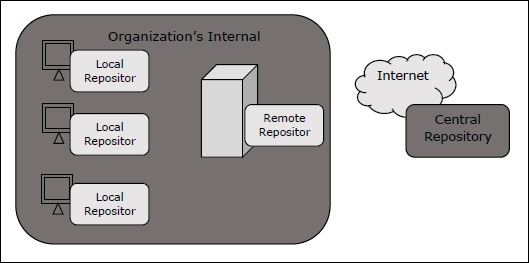

# SQL
## basic
- Query
- Insert
- Update
- Delete

# Java
## basic
- controller express
- basic string process
- Control multi thread
- connect mysql using JDBC
- connect mongodb
- OOP

# Mongo
- Installation
- Create schema with MongoDB Compass
- Connect with java
- Query, Insert, Update with java

# Maven (source: tutorialpoint.com)
## Overview
- Maven is a project management tool that provides deverlopers a complete builder lifecycle framework.
- Maven uses Convention over Configuration, which means deverlopers are not required to create build process themselvers. Cofiguration is placed in pom.xml
- Features of Maven
  - Simple project setup that follows best practices.
  - Consistent usage across all project.
  - Dependency management including automatic updating.
  - A large and growing repository of libraries.
  - Extensible, with the ability to easily write plugins in Java or scripting languages.
  - **Model-based builds** - Maven is able to build any number of projects into predefined output types such as jar, war, metadata.
  - **Coherent site of project information** - Using the same metadata as per the build process, maven is able to generate a website and a PDF including complete documentation.
  - **Release management and distribution publication** - without additional configuration, maven will integrate with your source control system such as CVS and manages the release of a project.
  - **Backward Compatibility** - You can easily port the multiple modules of a project.
  - **Parallel builds** - It analyzes the project dependency graph and enables you to build schedule modules in parallel. -> performence improvents

## POM
- POM stands for Project Object Model, format xml, contains configurations and other informations of project.
- Configurations:
  - Project dependencies
  - plugins
  - goals
  - build profiles
  - project version
  - deverlopers
  - mailing list

## Repositories
- Repository is a directiory where all the project jars, library jar, plugins or any other project specific artifacts are stored and can be used by Maven easily.
- Maven repository are of three types
  - local
  - central
  - remote
  
  
- Local Repository
  - is a folder location on your machine. It gets created when you run any maven command for the first time.
  - keeps project's all dependencies (library jars, plugin jars...)
  - When you run a Maven build, the Maven automatically downloads all the dependency jars into the local reporsitory.
  - Maven local repository by default get created by Maven in %USER_HOME% directory. To override the default location, mention another path in Maven settings.xml
  
```xml
  <settings xmlns = "http://maven.apache.org/SETTINGS/1.0.0"
   xmlns:xsi = "http://www.w3.org/2001/XMLSchema-instance"
   xsi:schemaLocation = "http://maven.apache.org/SETTINGS/1.0.0 
   http://maven.apache.org/xsd/settings-1.0.0.xsd">
   <localRepository>C:/MyLocalRepository</localRepository>
  </settings>
```
- Central Repository
  - is provided by Maven community. It contains a large number of commonly used libraries.
  - URL: https://repo1.maven.org/maven2/
  - this repository is managed by Maven community.
  - it is not required to be configured.
  - it requires internet access to be searched.

- Remote Repository
  - Sometimes, Maven can't find a mentioned dependency in central repository -> error message. 
  - To prevent such situation, Maven provides concept of Remote repository, which is developer's own custion repository containing required libraries or other projects jars.

```xml
<project xmlns = "http://maven.apache.org/POM/4.0.0"
   xmlns:xsi = "http://www.w3.org/2001/XMLSchema-instance"
   xsi:schemaLocation = "http://maven.apache.org/POM/4.0.0
   http://maven.apache.org/xsd/maven-4.0.0.xsd">
   <modelVersion>4.0.0</modelVersion>
   <groupId>com.companyname.projectgroup</groupId>
   <artifactId>project</artifactId>
   <version>1.0</version>
   <dependencies>
      <dependency>
         <groupId>com.companyname.common-lib</groupId>
         <artifactId>common-lib</artifactId>
         <version>1.0.0</version>
      </dependency>
   <dependencies>
   <repositories>
      <repository>
         <id>companyname.lib1</id>
         <url>http://download.companyname.org/maven2/lib1</url>
      </repository>
      <repository>
         <id>companyname.lib2</id>
         <url>http://download.companyname.org/maven2/lib2</url>
      </repository>
   </repositories>
</project>
```

- Maven Dependency search sequence
  - local repository
  - central repository
  - remote repository


## Plugins
- Can done some task by automatic
- Maven plugins are generally used to:
  - create jar file
  - create war file (Web Application Resource)
  - compile code files
  - unit testing of code
  - create project documentation
  - create project reports

# Json Web Token
- Step to verify:
  - user send usename and password to authentication
  - user send username and password to authentication
  - server received, verify and create JWT
  - server send JWT to user and user storage it to local
  - when user want to use api of server, user send request and JWT
  - Server verify JWT and send response to user.
- JWT has 3 part:
  - header.payload.signature
  - header: declare type signature and encode algorithm. Encode with base64

    ```json
    {
        "typ": "JWT",
        "alg": "HS256"
    }
    ```
  - payload: info session: issuer, subject, audience, expired time, issued at.... Encode with base64
  - signature: is created by combine Header+payload and encode algorithm (HMAC SHA-256)
  - base64 is method to convert binary to string, it can sent in network easily. Binaries is represented by ASCII.

# Vert.x
- send and listen message to addresss
- asynchronous
- event driven: not run unless they receive a msg.
- pub-sub

## Create a Verticle
- extends an AbstractVerticle
- Override **start()** and **stop()** method
- **start()** defines tasks during startup, with the goal to finish the whole deployment when other asynchronous taks are done.

```java
public class MyVerticle extends AbstractVerticle {
   @Override
   public void start(Future<Void> start) throws Exception {
      start.complete();
   }
}
```

## Deploy a Verticle

```java
public static void main(String[] args) {

        // simple deploy

Vertx.vertx().deployVerticle(MyVerticle.class.getName());

        // or with options and 10 instances

Vertx.vertx().

deployVerticle(MyVerticle.class.getName(),new DeploymentOptions().

setConfig(new JsonObject().

put("foo", "bar")).setInstances(10));

 }
```
## Using the Event Bus
- is the nervous system of Vert.x
- Each Vert.x instance creates one single event bus instance
- allows different parts of application to communicate with each other irrespective of what language they are written in

```java
EventBus eb = vertx.eventBus();

eb.consumer("my.endpoit.one", message -> {

    System.out.println("I have received a message: " + message.body());

});
```


# Chat App (Message Passing)
## Architecture


## Simple database
- Friend: username, friend_name, created_date
- User: username, password, token(JWT)
- Message: msgId, sender, receiver, msg, created_date

## Functions
- Login
- Logout
- Create account
- Add friend
- Get list friend
- Send message to friend
- Get list message
- Use JWT to check authority

## Class


- MongoConnection: get connect to mongo, contains methods query, insert, update data
- Friend, User, Message: instance contains attribute
- AuthenticateController,ChatController, FriendController, Controller
- ServerController: Create server socket to listen connect from user
- ServerSession: manage connect between server and client: receive request from client, process request and send response to client.
- ClientController: provides methods to send request to server and process response from server.
- ClientSession: manage connection between clients
- ClientListener: listen connect from other client
- IClientListener, IMsgListener: interface notify when client connect or message incomming.
- MainClient, MainServer: class run process client, server.
